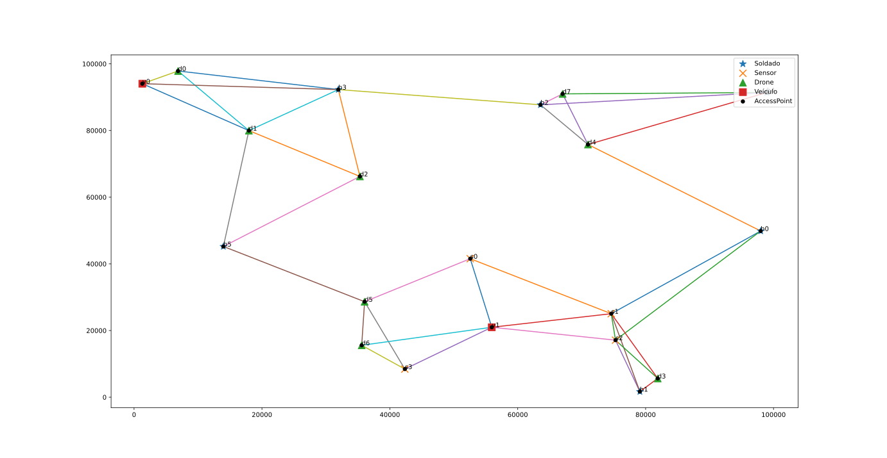
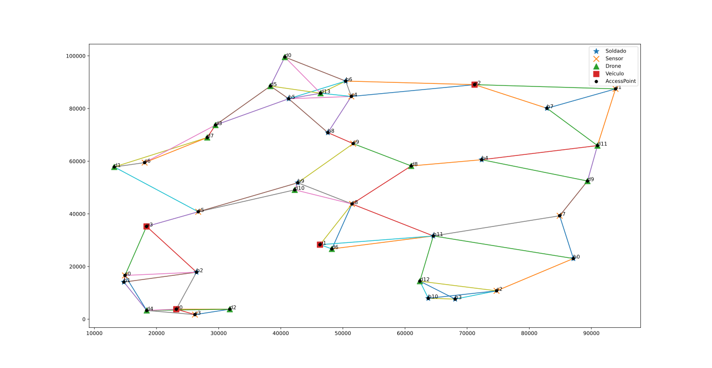
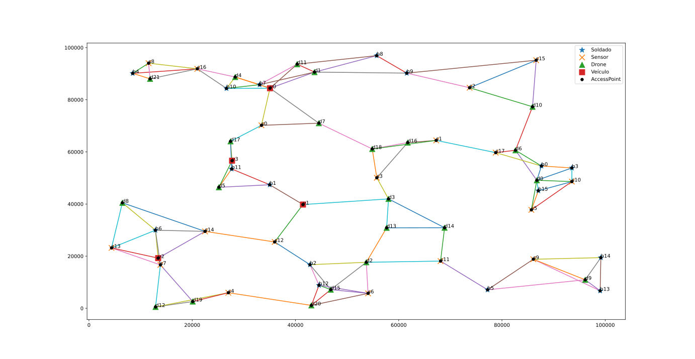
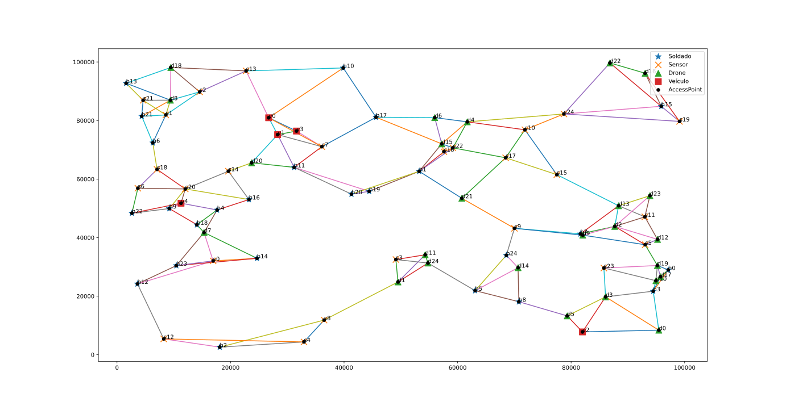
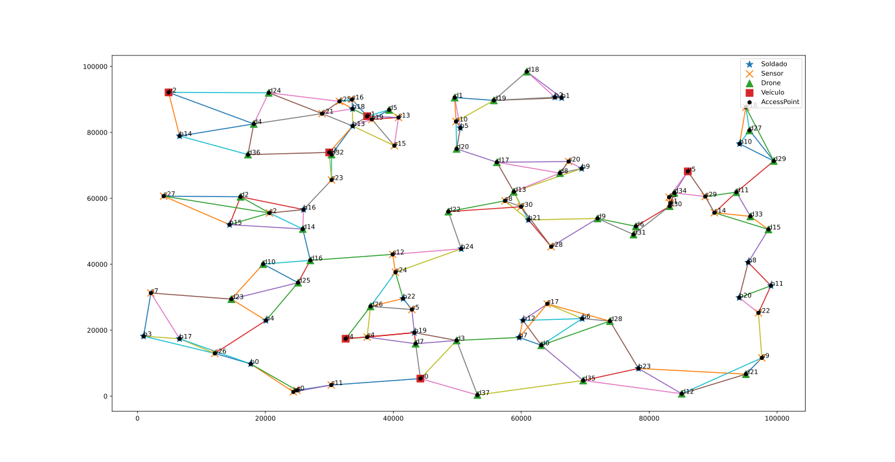

# ICN SDN Network

This repository contains scripts and components used in ICN/SDN simulations, and is the core component of my [final graduation thesis](https://lume.ufrgs.br/handle/10183/223942).

For MiniNDN and Mininet installation files and instructions see [Mini-NDN](https://github.com/named-data/mini-ndn)

In the near future, I will work on organizing the repo and creating a proper readme with instructions on how to setup and run the experiments.

## Topologies used in the experiments

**20 nodes**

**40 nodes**

**60 nodes**

**80 nodes**

**100 nodes**

